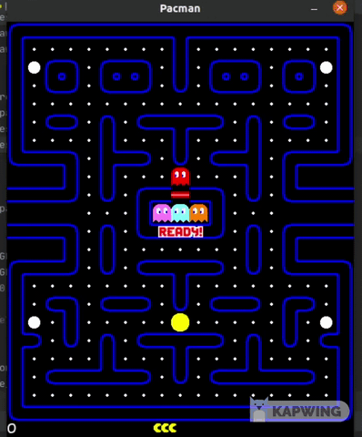

# PyPacman


The classic game of Pacman built with Pygame, provided also with a Reinforcement Learning environment. 



# Table of Contents

- [Quick Start](#quick-start)
    - [Game](#game)
    - [RL Enviroment](#rl-environment)

# Quick Start

## Game

Install the requirements
    
    pip install -r requirements.txt
    
Run the Game with the classic maze

    python main.py -lay classic -snd

Run the Game without music or sounds 

    python main.py -lay classic

Run the game with others option

    usage: main.py [-h] [-lay LAYOUT] [-snd] [-stt]

    Argument for the Pacman Game
    
    optional arguments:
      -h, --help            show this help message and exit
      -lay LAYOUT, --layout LAYOUT
                            Name of layout to load in the game
      -snd, --sound         Activate sounds in the game
      -stt, --state         Display the state matrix of the game
      
## RL Environment

The `PacmanEnv` class extends the `gym.Env` class, so if you already know how to
use the **open ai gym**, the api is the same. 

Here's a little example: 

```python
import gym

env = gym.make('pacman-v0', layout=self.layout, frame_to_skip=10)

for episode in range(episodes):
    env.reset()
    for i in range(max_steps):
        action = env.action_space.sample()
        obs, rewards, done, info = env.step(action)
        
        if done: 
            break
```

### Agent class 

The `src.env` folder provides also an abstract class that you can use to make your own AI agent.
You can use it to make your own agent, train it and directly plug into the game and see 
how will perform.

Here's how you can use it:

```python
from src.env.agent import Agent

class MyAgent(Agent):
    name = 'my_agent'

    def __init__(self):
        pass

    def act(self, state, **kwargs):
    """
    The code that return the action to take
    """
        pass
    
    def train(self, **kwargs):
    """
    Your code to train the agent
    """
        pass

```

And after you're done with the training you can simply plug it into the game:

```python
def run_agent(layout: str):
    agent = MyAgent(layout=layout)
    controller = Controller(layout_name=layout, act_sound=True, act_state=True, ai_agent=agent)
    controller.load_menu()
```

For more examples check out the [`examples`](./examples) folder.

# Todos

- [ ] refactor everything using ECS
- [ ] implement fruit
- [ ] flashing power pellet
- [x] state matrix in another screen
- [x] Provide an RL Environment so an AI agent can be trained

# License

MIT

# Author

Paolo D'Elia